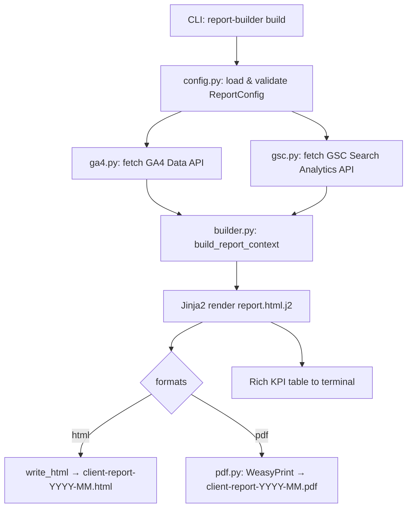

# agency-report-builder

[](LICENSE)
[](https://python.org/)
[](https://github.com/mehranmoghadasi/agency-report-builder)

> Pull GA4 and Google Search Console data for any client, render a branded HTML report with full KPI comparisons, channel breakdowns, and top queries — then export to PDF in one command.

---

## Mockup

```
┌──────────────────────────────────────────────────────────────────────┐
│ [ACME HARDWARE LOGO]                       Prepared by Bright Agency │
│ Acme Hardware                              Generated May 16, 2026    │
│ Marketing Performance Report — 2026-04-01 to 2026-04-30             │
├──────────────────────────────────────────────────────────────────────┤
│  WEBSITE PERFORMANCE (GA4)                                           │
│  ┌──────────┐ ┌──────────┐ ┌──────────┐ ┌──────────────────────┐   │
│  │ Sessions │ │  Users   │ │Conv.     │ │  Conv. Rate           │   │
│  │  12,840  │ │  9,210   │ │  318     │ │   2.5%               │   │
│  │ +14.2% ▲ │ │ +9.8% ▲ │ │ +22% ▲  │ │  Avg dur: 2:14       │   │
│  └──────────┘ └──────────┘ └──────────┘ └──────────────────────┘   │
│                                                                      │
│  ORGANIC SEARCH (GSC)                                                │
│  Clicks: 4,210 (+18%) │ Impressions: 98,400 (+12%) │ Pos: #11.4    │
│                                                                      │
│  Traffic by Channel          │  Top Search Queries                  │
│  Organic Search   7,200 ███  │  #1 acme hardware store   420 clicks│
│  Paid Search      2,100 ██   │  #2 hardware store edmonton 310      │
│  Direct           1,800 ██   │  #3 buy lumber online canada 180     │
│  Email              740 █    │  ...                                 │
└──────────────────────────────────────────────────────────────────────┘
```

---

## The Problem

Digital marketing agencies spend 3–6 hours per client per month manually copying GA4 and GSC numbers into slide decks and PDF reports. Tools like AgencyAnalytics and Whatagraph solve this — but cost $200–800/month for a 10-client agency.

Reported repeatedly in [r/digital_marketing](https://www.reddit.com/r/digital_marketing/) and confirmed by the [2026 agency stack survey at Riff Analytics](https://www.riffanalytics.ai/blog/seo-reporting-tools-for-agencies): *"We spend more time formatting reports than reading them."*

---

## The Solution

`agency-report-builder` is a Python CLI that reads a JSON client config, fetches KPIs and breakdowns from the GA4 Data API and the GSC Search Analytics API, and renders a polished, branded HTML report with period-over-period comparisons — optionally converting it to print-ready PDF via WeasyPrint. Zero SaaS subscription, full data ownership, white-label ready.

---

## Features

- **Branded per-client config** — client name, logo URL, accent colour, agency name — all via a single JSON file. One config file per client, version-controllable.
- **GA4 Data API integration** — sessions, users, new users, conversions, conversion rate, avg session duration, bounce rate; channel breakdown; top pages; device split.
- **GSC Search Analytics integration** — clicks, impressions, CTR, average position; top queries; top pages.
- **Period-over-period comparison** — automatically computes the previous period of equal length and shows percentage change on every KPI card.
- **HTML report with professional styling** — CSS variables for instant rebranding; responsive layout with KPI cards, data tables, and two-column sections.
- **PDF export via WeasyPrint** — one-command PDF with print-optimised CSS (`@page`, `page-break-inside: avoid`).
- **`preview` command** — build HTML and open directly in the browser for fast iteration.
- **`validate` command** — check a config file for errors without touching the API.
- **Rich terminal output** — colour-coded KPI table with change arrows printed to the terminal on every build.

---

## Architecture



**Trade-offs:** Jinja2 is chosen for its mature template ecosystem and clean separation of data from presentation. WeasyPrint produces print-quality PDFs from CSS without requiring a headless browser. The config uses Pydantic v2 for strict validation and clear error messages.

---

## Tech Stack

- **Language** — Python 3.10+
- **GA4** — `google-analytics-data` (GA4 Data API v1beta)
- **GSC** — `google-api-python-client` (webmasters v3)
- **Auth** — `google-auth`, service account JSON key
- **Templating** — `jinja2` v3
- **PDF** — `weasyprint` v61+
- **CLI** — `click` v8
- **Terminal UI** — `rich` v13
- **Validation** — `pydantic` v2
- **Testing** — `pytest`, `pytest-mock`

---

## Installation

**Prerequisites:** Python ≥ 3.10, a Google service account with GA4 and Search Console read access.

```bash
# 1. Clone and install
git clone https://github.com/mehranmoghadasi/agency-report-builder.git
cd agency-report-builder
pip install -e ".[dev]"

# 2. (PDF only) Install WeasyPrint system dependencies
# macOS:
brew install pango cairo gdk-pixbuf
# Ubuntu/Debian:
sudo apt-get install libpango-1.0-0 libcairo2 libgdk-pixbuf2.0-0

# 3. Add your Google service account credentials
cp /path/to/service-account.json ./credentials.json

# 4. Create a client config
cp examples/report-config.example.json report-config.json
# Edit report-config.json with your client's details

# 5. Validate the config
report-builder validate --config report-config.json

# 6. Build the report
report-builder build --config report-config.json --format html --format pdf
```

---

## Usage

### 1. Build a full report (HTML + PDF)
```bash
report-builder build --config ./configs/acme-hardware.json --format html --format pdf
```
**Expected terminal output:**
```
╭─────────────────────────────────╮
│       Agency Report Builder     │
╰─────────────────────────────────╯
  Client:    Acme Hardware
  Period:    2026-04-01 → 2026-04-30
  Formats:   html, pdf
  Output:    ./reports

  Fetching GA4 data...  ✔
  Fetching GSC data...  ✔

  ╭──────────────────────┬─────────┬────────────╮
  │ Metric               │ Value   │ vs Previous│
  ├──────────────────────┼─────────┼────────────┤
  │ Sessions (GA4)       │  12,840 │ +14.2%     │
  │ Users (GA4)          │   9,210 │  +9.8%     │
  │ Conversions (GA4)    │     318 │ +22.0%     │
  │ Conv. Rate (GA4)     │   2.5%  │ —          │
  │ Clicks (GSC)         │   4,210 │ +18.0%     │
  │ Impressions (GSC)    │  98,400 │ +12.0%     │
  │ Avg Position (GSC)   │   #11.4 │ —          │
  ╰──────────────────────┴─────────┴────────────╯

✔  Report generated:
   → ./reports/acme-hardware-report-2026-04.html
   → ./reports/acme-hardware-report-2026-04.pdf
```

### 2. Validate a config file
```bash
report-builder validate --config ./configs/acme-hardware.json
# ✔  Config is valid.
```

### 3. Preview in browser
```bash
report-builder preview --config ./configs/acme-hardware.json
# Opens the HTML report in your default browser instantly.
```

---

## Sample Output

**`examples/sample-report.html`** — see the `/examples` directory for a rendered HTML report with realistic redacted data.

**Client config example (`report-config.json`):**
```json
{
  "client_name": "Acme Hardware",
  "client_logo_url": "https://acme-hardware.com/logo.png",
  "agency_name": "Bright Digital Agency",
  "brand_colour": "#D97706",
  "ga4_property_id": "properties/123456789",
  "gsc_site_url": "https://acme-hardware.com/",
  "date_range": { "start": "2026-04-01", "end": "2026-04-30" },
  "output_dir": "./reports/acme",
  "formats": ["html", "pdf"],
  "credentials_path": "./credentials.json",
  "top_n": 10
}
```

---

## Roadmap

1. **Multi-client batch mode** — `report-builder batch --configs-dir ./configs/` to generate all client reports in one command
2. **Email delivery** — automatically attach and email each report to the client on generation
3. **LLM-generated narrative** — use the GA4/GSC deltas to auto-generate 3-paragraph "key insights" commentary via OpenAI or Anthropic API
4. **Google Ads integration** — add an optional third data source for spend, impressions, CPC
5. **Scheduled reports** — `report-builder schedule` to set up cron-based monthly report delivery
6. **Custom template support** — allow `--template` override to point at agency-branded Jinja2 templates

---

## Project Structure

```
agency-report-builder/
├── README.md
├── LICENSE
├── .gitignore
├── pyproject.toml
├── src/
│   └── report_builder/
│       ├── __init__.py
│       ├── cli.py           # Click CLI (build, validate, preview)
│       ├── config.py        # Pydantic config loader & validator
│       ├── ga4.py           # GA4 Data API client
│       ├── gsc.py           # GSC Search Analytics API client
│       ├── builder.py       # Context assembly + Jinja2 rendering
│       ├── pdf.py           # WeasyPrint PDF export
│       └── templates/
│           └── report.html.j2  # HTML report template
├── tests/
│   └── test_builder.py
├── docs/
│   ├── ARCHITECTURE.md
│   └── USAGE.md
└── examples/
    ├── report-config.example.json
    └── sample-report.html
```

---

## Contributing

Issues and PRs welcome. If you're adding a new data source (e.g. Google Ads), follow the pattern in `ga4.py`: a typed dataclass for results, a `build_*_client()` factory, and a `fetch_*_data()` function.

## License

MIT — see [LICENSE](LICENSE)

## About the Author

[Mehran Moghadasi](https://github.com/mehranmoghadasi) is a digital marketing specialist focused on SEO, PPC, and analytics tooling. This project automates a task that costs agencies hundreds of hours per year.
